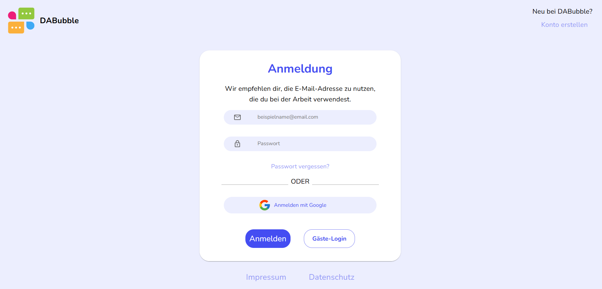
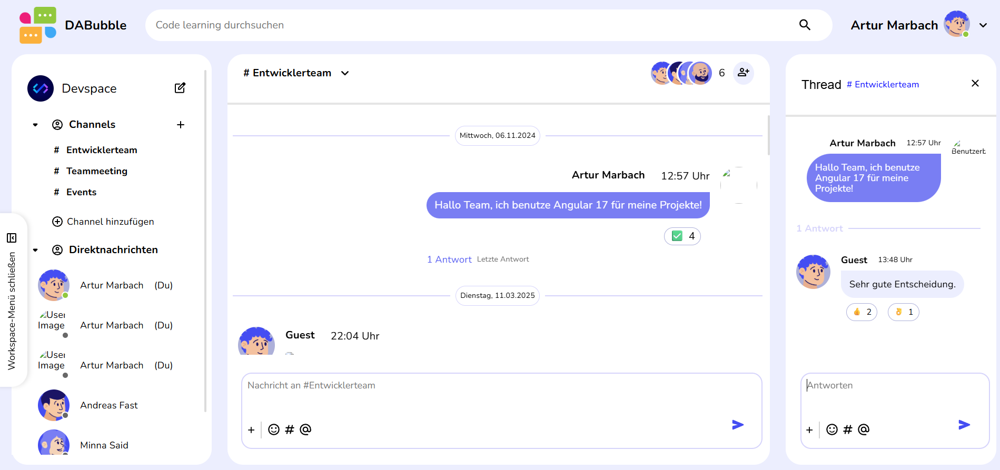
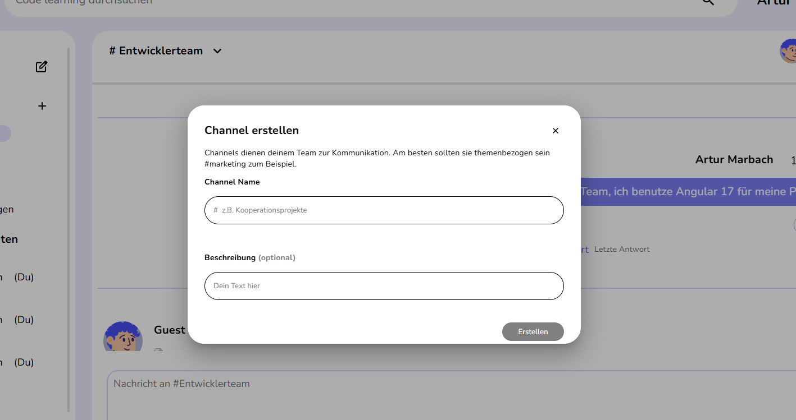

# Da-Bubble – Real-Time Chat Application (Slack Clone)

Da-Bubble is a modern real-time chat application inspired by Slack.  
It is built with Angular and focuses on scalable frontend architecture, real-time communication, and a clean, responsive user experience.

The project is designed as a production-style SaaS chat application with authentication, channel-based communication, and live data handling.


---

## Screenshots

### Authentication (Login)


### Chat Interface (Main View)


### Channel Management


---

## Table of Contents
- [Features](#features)
- [Tech Stack](#tech-stack)
- [Architecture Overview](#architecture-overview)
- [CI/CD Deployment](#cicd-deployment)
- [Kubernetes](#kubernetes)
- [Running Locally](#running-locally)
- [Project Purpose](#project-purpose)
- [Extras](#extras)

---

## Features

- Real-time messaging powered by Firebase
- Channel-based communication structure
- Authentication via Firebase Auth
- Responsive and modern UI/UX design
- Message persistence via backend integration
- Live updates and reactive UI state handling
- Component-based Angular architecture
- Scalable and reusable UI components

---

## Tech Stack

**Frontend:**
- Angular
- TypeScript
- RxJS
- SCSS

**Backend / Data Layer:**
- Firebase (Authentication, Firestore Database)
- Real-time data synchronization
- Reactive data handling with Angular services

**Infrastructure:**
- Docker
- GitHub Container Registry (GHCR)
- GitHub Actions (CI/CD)
- Kubernetes (minikube)
- Linux VM deployment

---

## Architecture Overview

Da-Bubble is built with a strong focus on scalable frontend architecture:

- Modular Angular component structure
- Service-based data management
- Separation of UI, business logic, and data layers
- Reactive programming using RxJS for real-time updates
- Clean and maintainable folder structure
- Reusable UI components for scalability

### Key Engineering Focus

- Scalable frontend design patterns
- Real-time data flow handling
- Clean separation of concerns
- Maintainable application structure
- Production-oriented Angular architecture

---

## CI/CD Deployment

The project is fully containerized and automatically deployed using GitHub Actions, ensuring a fast and reliable production workflow.

### Pipeline Steps

1. **Build** – Angular app is built and dependencies are cached
2. **Test** – Angular unit tests run in headless Chrome
3. **Scan** – SAST security analysis via CodeQL
4. **Docker** – Image is built and pushed to GHCR
5. **Deploy** – Container is deployed to remote VM via SSH

### Highlights

- Fully automated deployment pipeline
- Docker build cache for faster builds
- SAST security scanning with CodeQL on every push
- Zero manual deployment effort
- Production-style workflow similar to real SaaS applications

---

## Kubernetes

The application is orchestrated with Kubernetes using the following manifests located in the `k8s/` folder:

- **deployment.yaml** – defines the Pod and container configuration
- **service.yaml** – exposes the application within the cluster
- **ingress.yaml** – routes external traffic to the service via hostname
- 
### Run locally with minikube

```bash
minikube start
minikube addons enable ingress
kubectl apply -f k8s/deployment.yaml
kubectl apply -f k8s/service.yaml
kubectl apply -f k8s/ingress.yaml
minikube service da-bubble --url
```

---

### Prerequisites

- Node.js
- Angular CLI
- Docker (optional)

### Setup

```bash
git clone git@github.com:A-Marbach/da-bubble.git
cd da-bubble
npm install
ng serve
```

## Application URL

```bash
http://localhost:4200
```

---

## Project Purpose

This project was built to demonstrate:

- Advanced Angular frontend development skills  
- Real-time application architecture  
- Scalable state and component management  
- Integration of frontend with backend APIs  
- Container orchestration with Kubernetes
- Production-level CI/CD pipeline with security scanning (CodeQL)
- Dockerized deployment workflow  
- Ability to build SaaS-style applications with modern frontend architecture  

---

## Extras

- Can be extended with voice/video communication features  
- Role-based permissions and channel management possible  
- Notification system for real-time updates  
- WebSocket optimization for large-scale usage  
- Potential migration to microfrontend architecture 

---

> Note: This project represents a production-style frontend application with emphasis on scalable architecture, real-time communication, and modern deployment workflows.
